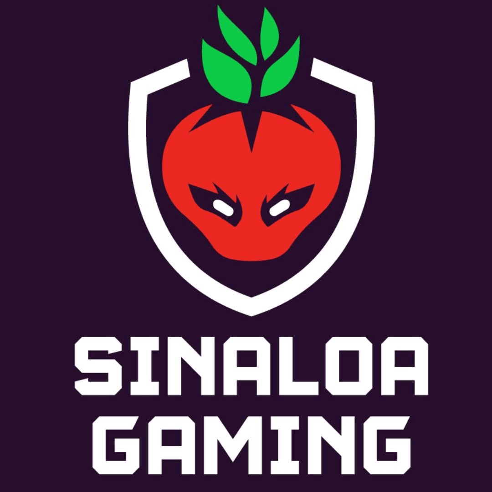

<p align="center">
  
</p>

# Sinaloa Gaming Landing Page

Landing page oficial de la comunidad **Sinaloa Gaming**.

---

<p align="center">
  <a href="https://instagram.com/sinaloagaming" target="_blank">
    
  </a>
  <a href="https://facebook.com/sinaloaesportsgaming" target="_blank">
    
  </a>
  <a href="https://twitch.tv/sinaloagamingesports" target="_blank">
    
  </a>
  <a href="https://discord.gg/E8ffQxpaAV" target="_blank">
    
  </a>
</p>

---

## Características

- Diseño responsive y moderno
- Enlaces a redes sociales (Twitch, Discord, Instagram, Facebook)
- Optimización SEO y meta etiquetas para redes sociales
- Accesibilidad y buenas prácticas web
- **Fuentes sans-serif en todo el sitio**
- **CSS centralizado en `styles.css`**
- Página especial para el Torneo Fortnite

## Estructura del proyecto

```
landingpages/
├── index.html
├── styles.css
├── torneofortnite/
│   └── index.html
├── statics/
│   ├── logo.png
│   └── torneofortnite/
│       └── image.png
│   └── favicon/
│       ├── favicon.ico
│       ├── favicon-16x16.png
│       ├── favicon-32x32.png
│       ├── apple-touch-icon.png
│       ├── android-chrome-192x192.png
│       ├── android-chrome-512x512.png
│       └── site.webmanifest
```

## Uso

1. Clona o descarga este repositorio.
2. Abre `index.html` en tu navegador.
3. Accede a la página del torneo en `torneofortnite/index.html`.
4. Asegúrate de que los archivos de imágenes y favicon estén en las rutas indicadas.

## Personalización

- Para agregar o modificar redes sociales, edita la sección `.social-icons` en `index.html`.
- Para cambiar estilos, edita `styles.css`.
- Para actualizar las bases del torneo, edita el contenido de `torneofortnite/index.html`.

## Créditos

Desarrollado por la comunidad de [Sinaloa Gaming](https://sinaloagaming.com)