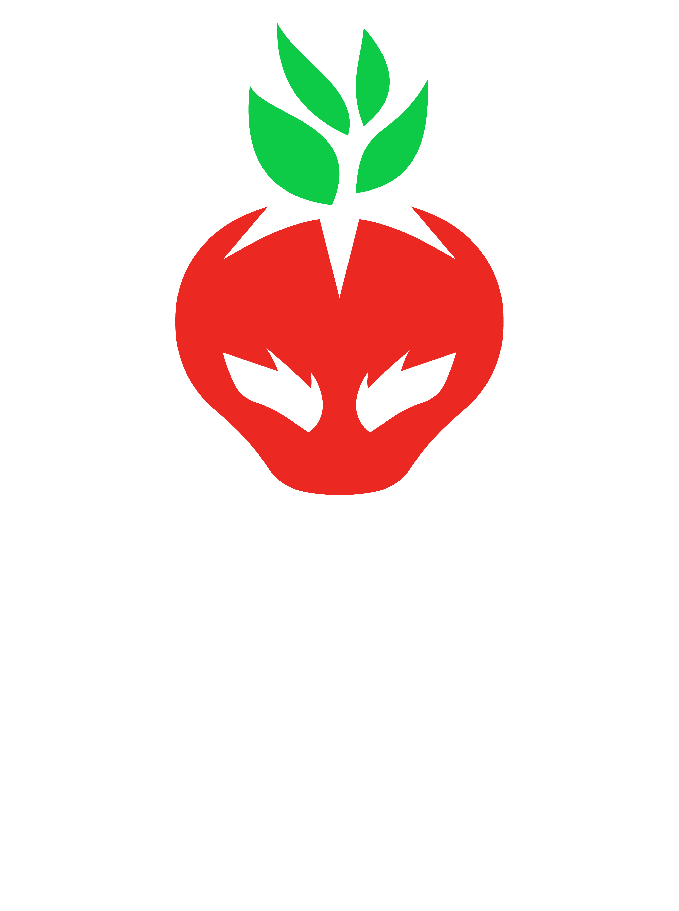

<p align="center">
  
</p>

# Sinaloa Gaming Landing Page

Landing page estática para la comunidad Sinaloa Gaming. Incluye torneos, resultados, videos de finales y secciones visuales modernas.

---

## Funcionalidades principales
- Página principal con torneos activos y pasados.
- Sección destacada para el torneo activo (FC25) con banner y botón de inscripción.
- Sección de torneos pasados (Fortnite) con video de la final y botón de resultados.
- Barra de tags con palabras clave e iconos gamer.
- Footer automático con fecha y hora de actualización.
- Diseño responsive (móvil y escritorio).
- SEO básico: meta etiquetas, Open Graph, Twitter Cards, sitemap y robots.txt.
- Página de estadísticas/resultados para torneos.
- Despliegue automatizado con Docker y NGINX.

## Releases (historial de despliegues)

Cada vez que se ejecute un despliegue, agrega aquí una entrada con la fecha y los cambios principales:

- 2025-06-03:
  - Initial commit
  - Update README.md
- 2025-06-07:
  - Actualización mayor: SEO, Docker, NGINX, Jenkins, PostgreSQL, sitemap, robots.txt y recomendaciones de build
- 2025-06-14:
  - Se reorganiza el contenido del website únicamente.
  - feat(tournament): Implementar activación temporal del botón de estadísticas
  - fix: favicons completos y referencias en todos los index.html
  - feat: Implementa contador regresivo y recarga automática para el evento
  - docs: actualiza README y corrige detalles en index.html para reflejar cambios recientes del evento
  - chore: automatiza despliegue a S3 y CloudFront con deploy.sh y hook post-commit
  - feat: agrega footer con fecha/hora de actualización en todas las páginas y actualiza deploy.sh
  - fix: permite continuar el despliegue aunque optipng no esté instalado (solo muestra advertencia)
  - mend
  - feat: add WhatsApp social media button with group link
  - feat: activate live stream and optimize page reloads
  - feat: add disclaimer message to tournament stats page
  - feat: maximize stats iframe height and remove hashtags for better mobile/desktop view
  - feat: add TikTok social media button with official icon and link
  - refactor: Clean up landing page and improve UI elements
- 2025-06-25:
  - feat: agrega página de torneo FC25 con registro Toornament y visuales consistentes
  - chore: agrega aviso de prueba a la página de torneo FC25
  - docs: agrega recomendación y botón para abrir registro de Toornament en nueva pestaña en FC25
- 2025-06-29:
  - feat: Agregar torneo FC25 con banner y página dedicada
- 2025-06-30:
  - style: actualizar footers, README y detalles visuales para nueva estructura de torneos y tags
  - refactor: fusionr buttons.css en style.css y eliminar imports innecesarios
  - Footer: copyright Sinaloa Gaming, fecha/hora estática, sin JS inline, responsivo para móvil/tableta

## Personalización
- Para agregar o modificar redes sociales, edita la sección `.social-icons` en `website/index.html`.
- Para cambiar estilos, edita `website/statics/style.css` o `torneo-style.css`.
- Para actualizar información de torneos, edita los archivos HTML correspondientes.


## Tecnologías empleadas
- **HTML5 y CSS3**: Todo el sitio está construido con HTML y CSS puro.
- **NGINX**: Servidor web para servir el sitio estático.
- **Docker**: Contenedores para despliegue fácil y reproducible.
- **Docker Compose**: Orquestación del contenedor NGINX.
- **AWS CLI**: Para despliegue en S3 y CloudFront (ver `deploy.sh`).
- **Meta etiquetas SEO**: Optimización para buscadores y redes sociales.
- **Imágenes optimizadas**: PNG y SVG para banners, logos y favicons.

## Estructura del proyecto
```
landingpages/
├── website/
│   ├── index.html
│   ├── torneofc25/
│   │   └── index.html
│   ├── torneofortnite/
│   │   ├── index.html
│   │   ├── estadisticas.html
│   │   └── score/
│   │       └── index.html
│   ├── statics/
│   │   ├── style.css
│   │   ├── torneo-style.css
│   │   ├── logo.png
│   │   ├── favicon/
│   │   └── ...
│   └── ...
├── Dockerfile
├── docker-compose.yml
├── nginx.conf
├── deploy.sh
└── README.md
```

## Plugins y librerías externas
- No se utilizan plugins externos ni frameworks JS (como jQuery, Bootstrap, etc.).
- Todo el código es propio y los estilos están en archivos CSS personalizados (`style.css`, `torneo-style.css`).

## Uso local
1. Clona o descarga este repositorio.
2. Abre `website/index.html` en tu navegador para ver la landing page.
3. Accede a las páginas de torneos en las rutas indicadas.
4. Asegúrate de que los archivos de imágenes y favicon estén en las rutas indicadas.

## Despliegue

### Opción 1: Docker local
1. Detén contenedores existentes:
   ```bash
   docker-compose down
   ```
2. Construye la imagen:
   ```bash
   docker-compose build
   ```
3. Levanta el contenedor:
   ```bash
   docker-compose up -d
   ```
4. Accede al sitio en [http://localhost:8080](http://localhost:8080)

### Opción 2: AWS S3 + CloudFront
1. Ejecuta el script de despliegue:
   ```bash
   ./deploy.sh
   ```
   - Optimiza imágenes PNG (si tienes optipng instalado).
   - Sincroniza archivos a S3.
   - Invalida caché de CloudFront.


## Créditos
Desarrollado por la comunidad de [Sinaloa Gaming](https://sinaloagaming.com).